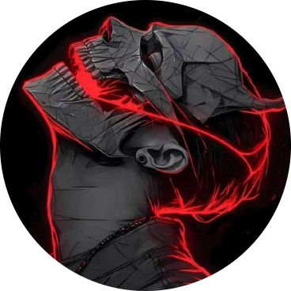

# Salut 👋, je suis Seny Toutou Diedhiou

  <picture>
    <source media="(prefers-color-scheme: dark)" srcset="65713703-modified.png">
    <source media="(prefers-color-scheme: light)" srcset="vrimg-modified.png">
    
  </picture>

## 🚀 À propos de moi

Je suis un **Développeur Data** passionné, spécialisé dans la conception de solutions techniques. Mon expertise inclut la création de pipelines de données ETL, le traitement de grandes volumétries de données avec des outils Big Data, et la gestion de bases de données SQL/NoSQL. Je suis capable de concevoir des flux de données performants et des solutions analytiques pour des prises de décision stratégiques.

- 🔭 Je travaille actuellement sur des projets de **Data Engineering et Machine Learning**.
- 🌱 J'apprends actuellement l'**IA générative et le Deep Learning**.
- 👯 Je cherche à collaborer sur des projets innovants axés sur les données.
- 💬 N'hésite pas à me poser des questions sur **Python, SQL, les pipelines ETL et la visualisation de données**.
- 📫 Comment me contacter : [Email](mailto:diedhiousenytoutou@outlook.com) | [LinkedIn](https://www.linkedin.com/in/seny-toutou-diedhiou) | [Portfolio](https://setoudie.github.io)
- ⚡ Fun fact : J'adore résoudre des problèmes complexes grâce aux données et les transformer en insights actionnables.

---

## 🛠️ Compétences

---

## 📚 Formation

- **Développeur Data** - Orange Digital Center (Fév - Nov 2024)
- **Bootcamp Data Science** - GoMyCode (Août - Nov 2023)
- **Master en Modélisation des Systèmes et Phénomènes Physiques** - Université Cheikh Anta Diop (UCAD) (2018 - 2024)
- **Certifications** : IBM Data and AI, Coursera Projects, Deeplearning.AI

---

## 📊 Statistiques GitHub

  
  

---

## 🏆 GitHub Trophies

  

---

## 🎯 Objectifs pour 2025

- 🎓 **Trouver un stage** : Intégrer une entreprise innovante pour appliquer mes compétences en Data Engineering et Machine Learning.
- 🌐 **Développer mon réseau professionnel** : Participer à des événements tech, hackathons et conférences pour rencontrer des professionnels du secteur.
- 🚀 **Contribuer à des projets open-source** : M'impliquer dans des projets open-source pour partager mes connaissances et apprendre des autres.
- 📚 **Approfondir mes compétences en IA avancée** : Explorer des domaines comme le Reinforcement Learning et l'IA générative.

---

## 📫 Restons en contact !

N'hésite pas à me contacter si tu souhaites collaborer ou simplement discuter de données, d'IA ou de tech en général !

- **Email** : [diedhiousenytoutou@outlook.com](mailto:diedhiousenytoutou@outlook.com)
- **LinkedIn** : [Seny Toutou Diedhiou](https://www.linkedin.com/in/seny-toutou-diedhiou)
- **Portfolio** : [setoudie.github.io](https://setoudie.github.io)

---

## 🙏 Merci pour ta visite !

Je suis toujours ouvert à de nouvelles opportunités et collaborations. Créons quelque chose d'incroyable ensemble ! 🚀
